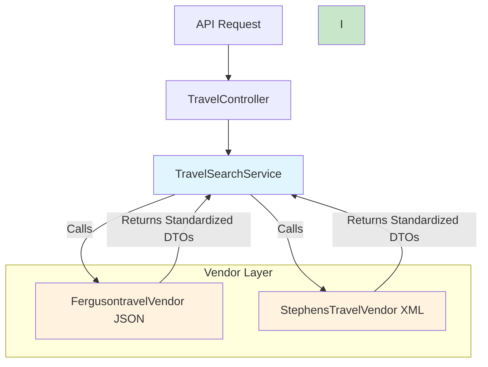

# B2B Travel Platform

## Requirements
- **Premise**: Build V1 of a B2B Travel platform.
- **Objectives**:
    - Architect a system that handles multiple 3rd party data platforms.
    - The 3rd party data will be in different shapes and formats.
    - Build examples for 2 different formats (JSON and XML).
- **Tech**: Laravel

## 🎯 Implementation Overview
This is a mock implementation that demonstrates:
- **Multiple Data Formats**: Integration with JSON (Fergusontravel) and XML (StephensTravel) vendors.
- **Principles**: A simple, interface-based design with dependency injection.
- **Unified API**: A single endpoint that exposes aggregated data from multiple vendors.

## Decisions
- **Single Search Service**: All searches go through a single `TravelSearchService`.
- **Unified DTOs**: Standardized `SearchCriteria` and `VendorResponse` DTOs create a consistent contract for data.
- **Centralized Vendor Registration**: A `VendorServiceProvider` is used to register all vendors in one place.
- **Singletons**: Used to avoid multiple instances of a class.
- **Direct Data Transformation**: Each vendor is responsible for transforming its own data, keeping it simple.
- **Unified Response**: `TravelSearchResource` ensures a unified response format.

## Data Flow
```
Request → TravelController → TravelSearchService → Multiple Vendors (JSON/XML) → Unified Response
```

## API Endpoints
#### Hotel Search
```http
GET /api/v1/travel/hotels/search?destination=Miami&check_in_date=2024-02-01&check_out_date=2024-02-05
```

#### Flight Search
```http
GET /api/v1/travel/flights/search?origin=JFK&destination=LAX&departure_date=2024-02-01&return_date=2024-02-08
```

## Core Architecture
```
app/
├── DTOs/                       # Type-safe Data Transfer Objects
│   ├── StandardizedData/       # Standardized DTOs
│   └── Vendor/                 # Vendor-specific DTOs
│
├── Services/                   # Business Logic Layer
│   ├── TravelSearchService.php # Multi-vendor orchestration
│   └── Vendors/V1/             # Vendor implementations
│       ├── FergusontravelVendor.php # JSON vendor
│       └── StephensTravelVendor.php # XML vendor
│
└── Http/Controllers/Api/V1/
    └── TravelController.php    # Unified API endpoints
```

## Details
- **JSON Format**: `FergusontravelVendor`.
- **XML Format**: `StephensTravelVendor` with SimpleXML processing.
- **Unified Output**: Both formats are transformed into a consistent array structure by their respective vendors.

The endpoints return mock data processed through both JSON and XML vendors, demonstrating the type-safe multi-format aggregation.

##  Visualiser

